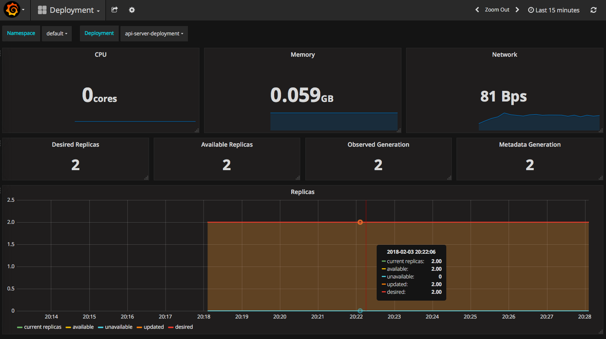

# Monitoring

## Solution Overview

| Solution | Purpose
| - | -
| Prometheus | Open source systems monitoring and alerting toolkit.
| Grafana | Open source metric analytics & visualization suite.

## Procedure

1. Clone the prometheus-operator repository

    ```bash
    git clone https://github.com/coreos/prometheus-operator.git
    ```
 1. To deploy Prometheus and Grafana 
 
    ```bash
    cd prometheus-operator/contrib/kube-prometheus/
    hack/cluster-monitoring/deploy
    ```
1. To see the Grafana UI, first enable the port forwarding to the POD running Grafana
    ```bash
    kubectl port-forward -n monitoring $(kubectl get pod -n monitoring | awk '/grafana/{print $1}') 3000:3000
    ```
OUTPUT:
```bash
Forwarding from 127.0.0.1:3000 -> 3000
```

Open a browser to 127.0.0.1:3000 to see the dashboards.

